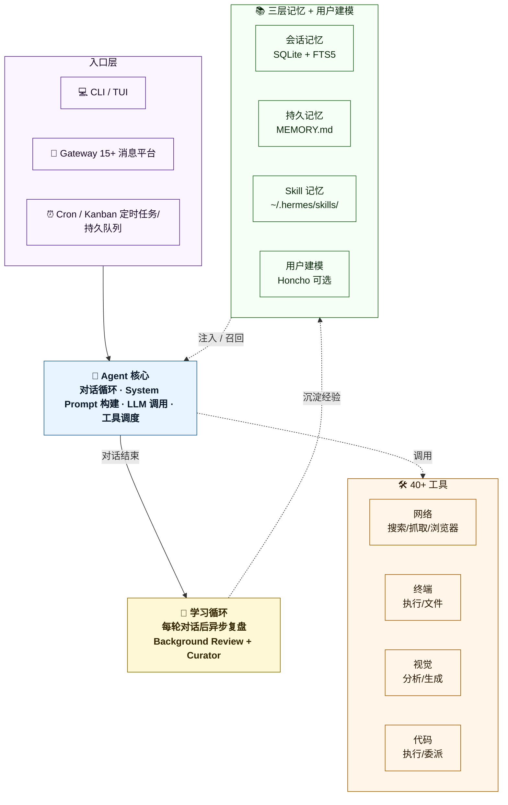
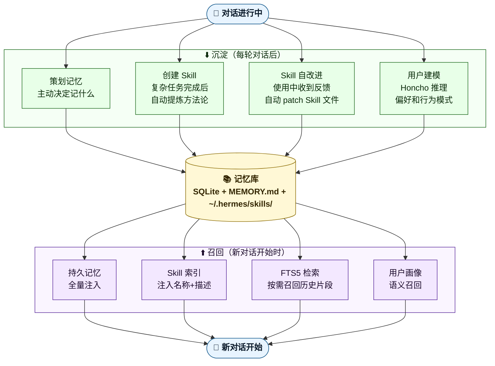
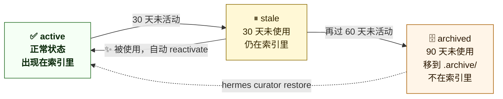
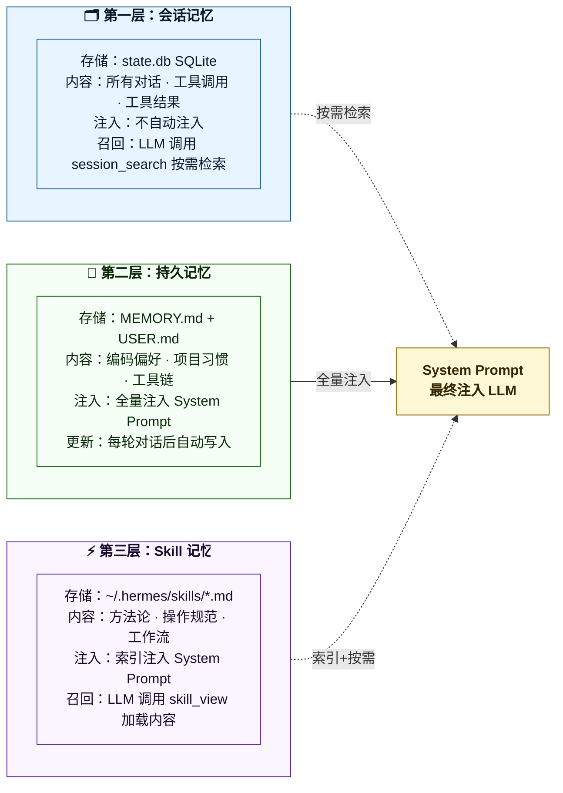
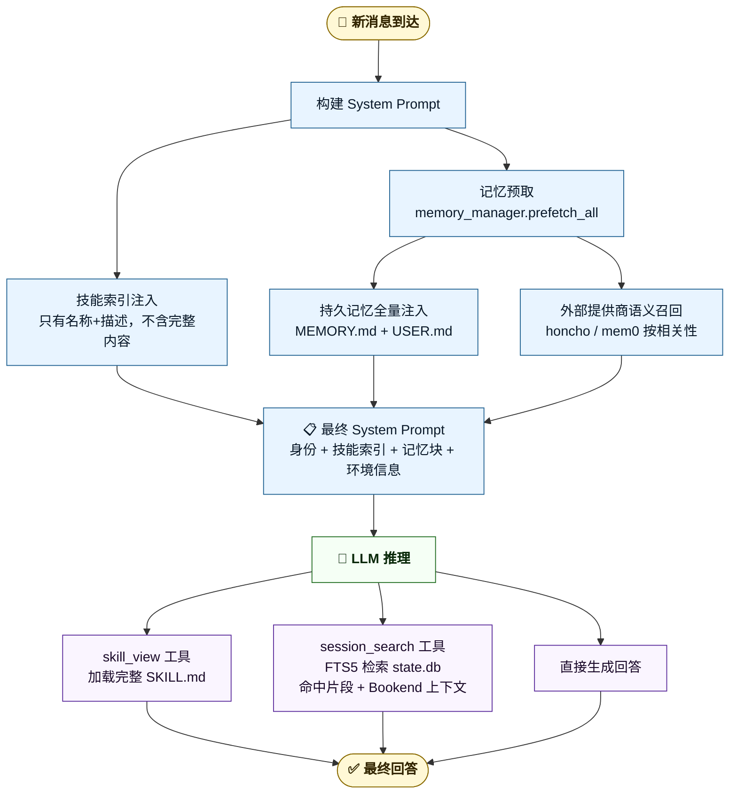

# Hermes Agent ☤ 完整指南

---

## 目录

1. [认识 Hermes Agent](#1-认识-hermes-agent)
2. [整体架构](#2-整体架构)
3. [核心亮点深入](#3-核心亮点深入)
4. [快速上手](#4-快速上手)

---

## 1. 认识 Hermes Agent

### 1.1 它是什么

**Hermes Agent 是一个完整的、可自托管的 AI Agent 运行时。** Nous Research 将其定位为 Harness Engineering 概念的产品化实践。

用一句话说：它是一个你可以部署在自己服务器上、接入任意 LLM、通过 Telegram/微信/命令行等任意渠道使用的 AI 助手框架——而且它会随着使用不断变得更聪明。

它不是：

- ❌ 一个 SDK 或库（不是 LangChain 那种"你来搭积木"的框架）
- ❌ 一个绑定特定模型的产品（不是只能用 Claude 或 GPT）
- ❌ 一个只能在本地跑的工具（不是只能在你笔记本上用）

它是：

- ✅ 一个**开箱即用的 Agent**，安装后直接可用
- ✅ **模型无关**：接入 200+ 模型，一行命令切换，零代码改动
- ✅ **平台无关**：同一个 Agent 同时服务 CLI、Telegram、飞书、Discord……
- ✅ **会自我进化**：从每次对话中提炼经验，写成技能，下次直接复用

```
你在 Telegram 发消息 → Hermes 在云服务器上执行任务
                     → 任务完成后把结果发回给你
                     → 顺便把这次学到的东西写成技能存起来
```

---

### 1.2 为什么会有它

现有 Agent 工具有三个共同痛点：每次对话都是白板（经验无法跨会话积累）、深度绑定特定模型或平台（换模型要改大量代码）、只能在本地跑（无法在服务器后台长时间运行同时用手机查看进度）。

| 痛点 | Hermes 的解法 |
|---|---|
| 每次都是白板 | 闭环学习系统：技能自动创建 + 跨会话记忆 |
| 模型/平台绑定 | 插件化模型提供商 + 15+ 消息平台网关 |
| 只能本地跑 | 6 种终端后端（本地/Docker/SSH/云服务器） |

Hermes 由 [Nous Research](https://nousresearch.com) 维护，MIT 开源，约 17,000 个测试用例。

### 1.3 它能做什么

一个 `hermes` 命令启动，内置 40+ 工具覆盖网络（搜索、抓取、浏览器自动化）、终端（执行命令、操作文件）、视觉（图片分析/生成）、代码执行等场景。一个 `hermes gateway start` 命令，同时接入 15+ 消息平台：

```
Telegram · Discord · Slack · WhatsApp · Signal · 飞书 · 钉钉 · 企业微信 · 微信 · QQ Bot · Email · SMS
```

内置 Cron 调度器支持自然语言设置定时任务，多 Agent 并行可以把复杂任务拆分给多个子 Agent 同时执行。

### 1.4 一个简单的闭环系统

Hermes 的核心模块不是一条线性流程，而是一个**多入口、多记忆层、有反馈循环**的系统：



**入口层**（多入口）：CLI、Gateway、Cron 都是平等的入口，不是顺序关系。在 Telegram 发的消息和在命令行发的消息进入的是同一个 Agent 核心。

**Agent 核心**（对话循环）：负责构建 System Prompt、调用 LLM、调度工具，是所有入口共享的执行引擎。

**三层记忆 + 用户建模**：在每次对话开始时被注入到 System Prompt（持久记忆全量、Skill 索引、Honcho 画像），在对话过程中按需召回（会话记忆通过 FTS5 检索）。

**40+ 工具**：Agent 的"手脚"，按 toolset 分组，每个会话可以启用不同的子集。

**学习循环**：横跨整个系统的反馈机制，每次对话结束后由 Background Review 异步分析，把经验沉淀回三层记忆。这是 Hermes 区别于其他 Agent 的关键——记忆不是被动写入的，是主动复盘提炼的。

#### 学习循环的内部流转

放大看学习循环这一环，它由"沉淀"和"召回"两个反向流程组成：对话产生的经验沉淀进记忆库（向下），新对话开始时按需召回（向上），形成持续改进的飞轮。



**沉淀**是经验从对话流入记忆库：每轮对话后主动复盘，决定写入什么持久记忆、提炼什么 Skill、是否需要 patch 已有 Skill、Honcho 如何更新用户画像。

**召回**是经验从记忆库流回新对话：持久记忆和 Skill 索引在 system prompt 构建时全量注入；Skill 完整内容、会话历史片段在 LLM 推理过程中按需调用工具检索。

这套机制让 Hermes 既能把经验沉淀成结构化的记忆库（沉淀环节），又能在不撑爆上下文的前提下精准复用（召回环节）。**用得越多，记忆库越丰富，召回越精准，沉淀也更有的放矢——四件事同时变强**。

### 1.5 它和同类工具的关系

三个工具定位不同，不是竞争关系：Claude Code 做交互式编码（结对工程师）、OpenClaw 做配置即行为（写 SOUL.md 定制行为）、Hermes 做自主后台 + 自改进（7×24 自己跑自己学）。三者都采用 agentskills.io 标准，**Skill 可以互通**。

| 维度 | Hermes Agent | OpenClaw |
|---|---|---|
| **核心理念** | 自改进学习循环 | 配置即行为（SOUL.md） |
| **记忆** | 三层自改进（会话/持久/Skill） | 多层记忆，人工维护为主 |
| **Skill 维护** | Agent 自动创建 + 自改进 | 人工编写和维护 |
| **用户建模** | Honcho 辩证建模 | 基于 SOUL.md 配置 |
| **生态规模** | 40+ 内置工具 + MCP 集成 | 社区 Skill 生态更成熟 |
| **部署方式** | 自托管为主 | 官方托管/自托管 |

OpenClaw 社区生态更成熟，Hermes 的自动学习能力更强。两者侧重点不同，不是直接替代关系。一句话区分：**OpenClaw 是你养出来的龙虾，Hermes 是自己会长大的龙虾。**

#### Harness Engineering：理解 Hermes 的钥匙

Hermes 是 **Harness Engineering** 概念的产品化实践。核心思路：AI 的效果瓶颈往往不在模型本身，而在于围绕模型构建的约束、记忆、反馈和编排环境。

Harness Engineering 把这套方法论拆成五个组件，Hermes 把它们全部内建：

| Harness 五组件 | 手动实现方式 | Hermes 内建系统 |
|---|---|---|
| **指令层** | 手写 CLAUDE.md / AGENTS.md | Skill 系统（自动创建 + 自改进） |
| **约束层** | 配置 hooks / linter / CI | Tool permissions + toolset 按需启用 |
| **反馈层** | 人工审查 / 评估者 | Agent 自改进学习循环 |
| **记忆层** | 手动维护 knowledge base | 三层记忆 + Honcho 用户建模 |
| **编排层** | 自己搭多 Agent pipeline | 子 Agent 委派 + cron 调度 |

如果你用过 Claude Code 的 CLAUDE.md + hooks + memory，你已经在手动实现 Harness 了。Hermes 把这套手动流程变成了自动运行的系统。

---

## 2. 整体架构

### 2.1 五层模型

```
┌──────────────────────────────────────────────────────────────┐
│  入口层                                                       │
│  hermes CLI/TUI · gateway（消息平台）· api_server · cron     │
├──────────────────────────────────────────────────────────────┤
│  会话管理层                                                   │
│  AIAgent · 预算控制 · 上下文压缩 · 记忆注入 · 提示构建       │
│  三层记忆（会话/持久/Skill）· Honcho 用户建模（可选外挂）    │
├──────────────────────────────────────────────────────────────┤
│  工具编排层                                                   │
│  工具分发 · 并行执行 · 危险命令守卫 · 插件钩子               │
├──────────────────────────────────────────────────────────────┤
│  工具注册层                                                   │
│  tools/registry.py（零依赖）· tools/*.py（启动时注册）       │
├──────────────────────────────────────────────────────────────┤
│  模型提供商层                                                 │
│  plugins/model-providers/（28+ 提供商，插件化）              │
└──────────────────────────────────────────────────────────────┘
```

#### 入口层

三个主要入口，面向不同使用场景：

**交互式终端（CLI/TUI）**：有状态的长会话，持有 Agent 实例跨轮复用，配置启动时加载一次。

**消息平台网关（Gateway）**：管理 15+ 个平台适配器的生命周期，维护 Agent 实例缓存池，每条入站消息路由到对应会话的 Agent。同时负责过滤响应，防止敏感信息泄漏。

**定时任务调度（Cron）**：每 60 秒扫描到期任务，为每个任务构建 prompt 并启动独立 Agent 执行，强制 3 分钟硬中断防止失控，禁用交互类工具集。

**Kanban 任务队列**：SQLite 持久化的任务队列，支持多个 Hermes 实例作为 Worker 认领任务。与 Cron 的区别是任务由用户或 Agent 手动创建，进程崩溃后任务不丢、重启自动恢复，适合跨进程的长时间任务。

#### 会话管理层

Agent 的核心控制层，负责一次对话从开始到结束的全部状态管理：

**预算控制**：每次对话重置迭代预算（默认 90 次工具调用）。预算耗尽时不粗暴截断，而是给模型最后一次机会输出总结再退出。

**上下文压缩**：对话开始前估算 token 数，超过阈值时自动压缩历史消息。压缩是唯一允许重建 system prompt 的时机——其他时候 system prompt 全程不变，以保持 prefix cache 命中。

**记忆注入**：构建 system prompt 时注入持久记忆和 Skill 索引；每轮开始时预取外部记忆提供商的内容，结果整轮缓存复用。

**提示构建**：system prompt 只在会话第一轮构建，持久化后续复用。组装顺序：角色指令 → 持久记忆 → 上下文文件 → Skill 内容 → 工具使用指引。

#### 工具编排层

所有工具调用的统一入口，每次调用按顺序经过：参数类型校正 → 插件 pre-hook（可阻断）→ 实际执行 → 插件 post-hook（观察）→ 结果转换。

三个 hook 语义不同：pre-hook 做安全守卫（可以拒绝执行），post-hook 做可观测性（日志/监控），result-transform 在结果写入对话上下文之前允许插件修改内容。

#### 工具注册层

零依赖的工具注册表，是整个系统的基础。工具文件在启动时自注册，注册进来的工具还需归属某个 toolset 才会暴露给 LLM。所有工具调用统一经过注册表分发，保证始终返回 JSON，不向上层抛异常。

#### 模型提供商层

每个推理后端是一个声明式的 Provider Profile，描述该提供商的认证方式、API 端点、协议模式、默认模型列表等元数据，以及处理提供商特有行为的钩子（如特殊 header、请求体字段）。

发现机制懒加载：首次使用时才扫描内置插件目录和用户插件目录，同名提供商后注册者覆盖先注册者，用户可以在本地放同名插件覆盖内置行为。

### 2.2 工具注册机制

工具注册发生在进程启动时。启动时扫描工具目录，找到所有包含自注册调用的工具文件并逐个加载，每个文件在加载时将自己的名称、schema、处理函数、所属 toolset 注册进全局注册表。

新增工具只需新建一个文件并在其中完成自注册，不需要修改任何其他地方的列表或配置。

注册进注册表的工具不会全部暴露给 LLM，还要经过两层过滤：

```
注册表（所有已注册工具）
    ↓ toolset 过滤（按会话配置的启用/禁用 toolset）
    ↓ 可用性检查（依赖的环境变量或外部服务是否满足）
LLM 实际看到的工具列表（每次对话可以不同）
```

这意味着同一个 Hermes 实例，CLI 会话和 Telegram 会话可以看到完全不同的工具集，cron 任务可以禁用所有交互类工具，子 Agent 可以被限制为只有文件操作工具。

### 2.3 一个请求的完整生命周期

```
1. 用户发消息（Discord/Telegram/CLI）
        ↓
2. Gateway 接收 → 鉴权 → 加载会话历史
        ↓
3. AIAgent.run_conversation() 开始
   → 构建 System Prompt（注入技能索引、持久记忆、环境信息）
   → 调用 LLM API（携带过滤后的工具列表）
        ↓
4. LLM 返回工具调用
        ↓
5. handle_function_call() 执行工具
   → 危险命令审批检查（详见 3.6）
   → 调用具体工具，返回 JSON 结果
        ↓
6. 工具结果追加到消息历史，重新调用 LLM
   （循环，直到 LLM 不再调用工具，或预算耗尽）
        ↓
7. LLM 生成最终回答，Gateway 发回平台
        ↓
8. [后台 daemon 线程，用户不感知]
   Background Review 启动
   → 分析对话，决定是否创建/更新技能或写入记忆
```

步骤 4→6 是一个循环，不是单次调用。一次用户消息可能触发多轮 LLM 调用，每轮执行一批工具，直到 LLM 认为任务完成。

---

## 3. 核心亮点深入

### 3.1 闭环学习系统：Agent 如何自己写"外挂"

#### 问题：为什么大多数 Agent 不会进化？

传统 Agent 的工作方式：
```
对话 1：用户教 Agent 如何处理 Python 依赖冲突
对话 2：用户又得重新教一遍
对话 3：还是得重新教
```

每次对话都是白板，经验无法积累。

#### Hermes 的解法：Background Review

每次对话结束后，Hermes 会在后台悄悄做一件事：

```
主对话结束（用户立即收到回复，零延迟）
        ↓
[后台 daemon 线程启动，用户不感知]
        ↓
启动一个独立的 Review Agent 实例
→ 给它看刚才的完整对话记录
→ 问它："这次对话有没有值得保存的技能？"
        ↓
Review Agent 分析对话
→ 发现了一个处理 Python 依赖冲突的好方法
→ 调用 skill_manage(action="create") 写入技能文件
        ↓
~/.hermes/skills/python-deps/SKILL.md 创建完成
```

下次遇到类似问题，这个技能会被自动加载，Agent 直接复用经验。

#### 技能的"达尔文演化"

技能不是一次性写入的，它会随使用不断进化：

```
第 1 次：创建技能 "Python 依赖冲突处理"
第 3 次：用户说"你漏了检查虚拟环境这一步"
         → Review Agent 自动 patch 技能，补上这一步
第 10 次：技能已经包含了 10 次对话积累的经验
```

Review Agent 的 Prompt 明确要求优先 **patch 已有技能**，而不是无限新建：
```
优先级顺序：
1. 更新当前对话中已加载的技能（最优先）
2. 找到已有的同类技能并扩展它
3. 在已有技能下添加支持文件
4. 新建技能（最后手段）
```

#### Skill 索引：让大模型从几百个技能里精准选择

技能库膨胀到几百个 SKILL 文件后，怎么让 LLM 在不爆炸上下文的前提下找到合适的那一个？Hermes 的答案是 **索引 + 按需加载**。

每次构建 system prompt 时，Hermes 扫描所有 SKILL.md，**只提取每个技能的名字 + 60 字以内的描述**，按 category 分组组装成一个紧凑列表注入：

```
## Skills (mandatory)

<available_skills>
  github:
    - pr-review: Reviews PR changes against contributing guidelines.
    - issue-triage: Classifies issues by severity and component.
  python:
    - dependency-conflicts: Resolves uv/pip dependency clashes.
    ...
</available_skills>
```

按一个技能描述 ~50 字符算，**1000 个技能也只占约 5 万字符（约 12K token）**，远未撑爆上下文。LLM 看到索引后，根据当前任务判断哪个技能相关，主动调用 `skill_view(name)` 加载完整内容。这是经典的 "索引 + lazy load" 模式。

实际系统还做了几层过滤进一步收缩索引：

- **平台过滤**：标记为 `platforms: [macos]` 的技能在 Linux 平台不会出现
- **工具/toolset 条件过滤**：技能可以在 frontmatter 里声明依赖的工具，依赖不满足的不显示
- **session 级 disabled 列表**：用户可以临时禁用某些技能
- **强制约束**：每个技能的 description 必须 ≤ 60 字符（仓库规范，PR 评审会拒绝过长的）

这套机制让"几百个技能"和"几个相关技能"在 system prompt 里看起来差别不大，规模化的关键就在这里。

---

#### Curator：技能的"自动清洁工"

**为什么需要 Curator？**

索引机制让技能数量本身不会撑爆上下文，但仍然有两个问题需要解决：
- 同一类任务被创建了多个高度重叠的技能（比如 `pdf-extraction`、`docx-extraction`、`pptx-extraction` 各一份），稀释 LLM 注意力
- 三个月前解决某个一次性问题的技能，现在内容已经过时

Curator 就是为这两个问题设计的——**保持技能库精简和准确**。它是一个定期运行的独立 Agent（默认每 7 天，Agent 空闲 2 小时后启动）。

**Curator 的状态流转**

每个 Agent 创建的技能有 `active` / `stale` / `archived` 三种状态，Curator 依据"最后活动时间"自动转换：



关键设计：

- **stale 状态依然在索引里**，依然会暴露给 LLM。一旦再次使用，Curator 下次运行时检测到，**自动 reactivate 回 active**
- **archived 状态从索引里移除**，文件保留在 `.archive/` 目录，需要用户主动 `hermes curator restore` 才恢复
- **永远不删除**，只归档。最坏情况下也能完整恢复

**如果归档的技能再次需要怎么办？**

archived 技能不在索引里，LLM 看不到。这时候有两种结果：

- **大概率**：LLM 把它当新问题处理，可能创建一个新技能。如果新技能内容和某个归档的相似，下次 Curator 运行时会用 LLM review 检测到重复，建议合并
- **小概率**：LLM 处理得好但没沉淀。归档的就一直归档，但可恢复

**Curator 的 LLM review 还做合并**

不只是按时间归档，Curator 会让一个 LLM 检查所有技能内容，输出两类操作：

- **consolidations**：发现 N 个技能内容重叠，合并成一个 umbrella 技能（例如把 `pdf-extraction`、`docx-extraction`、`pptx-extraction` 合并成 `document-tools`），原技能移进 `.archive/`
- **prunings**：内容真的过时、没合并目标，直接归档

这是基于内容语义的合并，不是简单字符串匹配。

**设计权衡**

"90 天未使用" 不等于 "永远不会用"——年度审计、季度报告这类低频但关键的技能可能被错误归档。Hermes 接受这个误判，但用三个机制兜底：永远不删除、Curator 跑完会输出 summary 告知用户、可一键 restore。这是务实的工程取舍——完美判断"哪些技能该留"是不可能的，"宁可错杀，可恢复"是最稳的策略。

---

### 3.2 记忆设计：三层架构 + FTS5 全文搜索

#### 核心问题：记忆不是存得多，是找得准

大多数 AI 工具的记忆方案是"全量加载"——把所有历史对话塞进上下文。这个方案有三个致命问题：

1. **上下文爆炸**：活跃用户每天聊几千字，一个月就是几万字，很快超出模型的上下文窗口
2. **注意力稀释**：内容越多，模型越难聚焦在真正相关的部分，回答质量反而下降
3. **噪音污染**：大量无关的历史对话混入上下文，干扰当前任务的判断

Hermes 的解法是**三层分离 + 按需检索**：不同类型的记忆用不同的存储和召回策略，每次只加载当前任务真正需要的部分。

#### 三层架构



**三层的注入策略完全不同：**

| 层 | 存储位置 | 注入方式 | 触发时机 |
|---|---|---|---|
| 会话记忆 | `state.db`（SQLite） | 不自动注入，工具调用按需检索 | LLM 主动调用 `session_search` |
| 持久记忆 | `MEMORY.md` / `USER.md` | 全量注入 System Prompt | 每次对话开始时 |
| Skill 记忆 | `~/.hermes/skills/*.md` | 索引注入，内容按需加载 | LLM 看到索引后主动调用 `skill_view` |

这个设计的关键在于：**持久记忆通常很小（几百行），全量注入没有成本；会话历史可能很大，必须按需检索；Skill 内容可能很长，只注入索引让 LLM 自己决定要不要加载。**

#### 记忆检索决策流程



#### FTS5 技术实现

FTS5 是 SQLite 内置的全文搜索扩展，不需要额外部署搜索服务。Hermes 建了**两张虚拟表**解决不同语言的搜索问题：

```sql
-- 标准表：unicode61 分词器，按空格/标点分词，适合英文
CREATE VIRTUAL TABLE messages_fts USING fts5(
    session_id UNINDEXED,
    content
);

-- Trigram 表：3字节滑动窗口分词，解决中文无空格分词问题
-- "你好世界" → ["你好世", "好世界", "世界"] 支持任意子串搜索
CREATE VIRTUAL TABLE messages_fts_trigram USING fts5(
    session_id UNINDEXED,
    content,
    tokenize='trigram'
);
```

**触发器自动同步**：每次 INSERT/UPDATE/DELETE messages 表，触发器同步更新两张 FTS 表，无需手动维护索引。

**索引内容**：`content || tool_name || tool_calls`，工具调用的名称和参数也被索引，可以搜索"上次用了什么工具"。

**Bookend 机制**：FTS5 命中的消息可能在一个很长的会话中间，`session_search` 工具会同时返回：
- 命中消息的上下文窗口（前后 N 条）
- 会话开头几条（了解背景）
- 会话结尾几条（了解结论）

一次搜索获得完整上下文，而不需要加载整个会话。这是 Hermes 能在不撑爆上下文的情况下实现跨会话记忆的核心机制。

#### 和 Claude Code 记忆系统的对比

Claude Code 也有记忆系统：CLAUDE.md 文件和 auto-memory。两者的设计哲学完全不同：

| 维度 | Claude Code | Hermes Agent |
|---|---|---|
| **记忆格式** | CLAUDE.md + auto-memory 文本文件 | SQLite 数据库 + FTS5 索引 + Skill 文件 |
| **写入方式** | CLAUDE.md 手动写，auto-memory 半自动 | 全自动写入，人可以随时覆盖 |
| **检索方式** | 启动时全量加载 CLAUDE.md | 按需 FTS5 全文检索 |
| **记忆粒度** | 项目级（每个项目一份 CLAUDE.md） | 全局级 + 项目级都有 |
| **用户建模** | 无（需要用户自己写偏好） | Honcho 自动推理用户画像 |
| **程序性记忆** | CLAUDE.md 中的指令 | 独立 Skill 文件，可自改进 |
| **跨项目共享** | `~/.claude/CLAUDE.md`（全局指令文件） | 所有记忆天然全局 |
| **存储上限** | CLAUDE.md 建议控制在几 KB | SQLite 理论上限很高 |

**两者的设计哲学不同**：Claude Code 的 CLAUDE.md 是人编写、AI 执行的模式，好处是人有完全的控制权，坏处是需要持续投入维护。Hermes 是 AI 自写、人审核的模式，好处是门槛低、自动化程度高，坏处是自动生成的内容不一定都准确。

**哪种更好取决于使用场景**：如果你是重度 Claude Code 用户，已经花了几周精心打磨 CLAUDE.md，那你手工编织的缰绳可能比 Hermes 自动生成的更精准。但如果你不想花时间维护配置文件，Hermes 的全自动方案确实省心不少。

#### Honcho 用户建模：可选的"第四层记忆"

前面三层记忆解决的是"对话/项目/方法论"的存储和检索，但还有一类信息它们都无法捕捉：**用户本身的偏好和行为模式**。比如你倾向于直接回答还是先讨论，习惯用 emoji 还是纯文本，关注代码细节还是架构方向——这些不是某次对话的内容，而是跨越所有对话的行为画像。

Honcho 是 Hermes 的可选外部记忆提供商，专门做这件事：

```
每次对话结束
    ↓
Honcho 后台分析这次交互
    ↓
推导用户偏好、行为模式、兴趣领域
    ↓
更新用户画像（持续累积，不是覆盖）
    ↓
下次对话开始时，按相关性召回画像片段注入 system prompt
```

和持久记忆（MEMORY.md）的关键区别：MEMORY.md 是 Agent 主动总结的事实（"用户偏好 httpx 而不是 requests"），Honcho 是从行为推断的画像（"用户倾向于先看实现再讨论设计"）。前者是显式偏好，后者是隐式行为模式。

Honcho 是一个独立的记忆提供商插件，默认不启用，需要单独配置 API key。Hermes 还内置了其他几种记忆提供商（mem0、supermemory 等），用户可以按需替换。这一层不是 Hermes 的核心功能，但对于追求"越用越懂你"的场景很有价值——也是 1.4 节闭环图里"用户建模"环节的实现。

---

### 3.3 多 Agent 协作

| 模式 | 本质 | 适用场景 |
|---|---|---|
| `delegate_task`（leaf） | 父子 Agent 协作，父等子完成 | 需要隔离上下文的子任务 |
| `delegate_task`（orchestrator） | Coordinator-Worker 模式，子可继续委派 | 需要多层拆解的复杂任务 |
| MoA 多模型投票 | 多模型并行回答同一问题，聚合结果 | 极难的推理/分析问题 |
| Background Review | 主 Agent 与 Review Agent 异步分工 | 技能/记忆的自动沉淀 |

#### delegate_task：父子协作 / Coordinator 模式

delegate_task 是 Hermes 多 Agent 协作的主要机制，下面分三个维度展开：**角色与递归**、**通信方式**、**上下文隔离**。

**角色与递归**

delegate_task 支持两种角色：

- **leaf（默认）**：专注执行，不能再委派，不能调用记忆/消息工具。父 Agent 等子 Agent 完成后拿到文字总结继续。
- **orchestrator**：子 Agent 自己也能继续 `delegate_task`，形成多层树状结构。默认最大深度 2（父→子→孙），可配置到 3。这就是 Coordinator-Worker 模式——orchestrator 负责拆解和协调，leaf worker 负责执行，orchestrator 自己综合所有 worker 的结果再返回给父 Agent。

支持批量并行：一次委派多个子任务，多个子 Agent 在独立线程中同时执行，父 Agent 等所有子 Agent 完成后汇总，并发数可配置（默认 3）。

**通信方式**

Hermes 的父子通信是**同步直接调用**：父 Agent 在线程池里直接调用 `child.run_conversation(goal)`，阻塞等待返回。子 Agent 完成后把最终回答作为文字结果返回给父 Agent，父 Agent 只看到这段文字总结，看不到子 Agent 的中间工具调用和推理过程。

进度信息（当前在执行哪个工具、第几次迭代）通过 callback 函数实时传给父 Agent 的 spinner 做 UI 展示，但不进入父 Agent 的对话上下文。

这和 Claude Code 的设计思路不同。Claude Code 用消息队列：父 Agent 调 SendMessage 工具把消息写进子 Agent 的"信箱"，子 Agent 在自己的循环边界自己来取；子 Agent 完成后把结果拼成 XML 伪装成用户消息注入父 Agent 的对话。这种异步消息驱动的好处是父 Agent 不阻塞，可以同时派多个子 Agent 并发，谁先完成谁先通知。Hermes 的同步方案更简单，但父 Agent 在等待期间无法处理其他事情。

**上下文隔离**

子 Agent 完全隔离：独立的上下文（看不到父 Agent 的对话历史）、独立的终端会话（文件操作互不干扰）、独立的 system prompt（只包含任务目标，不共享父 Agent 的 system prompt）。

这意味着**没有 prompt cache 共享**。每个子 Agent 都要从头构建自己的 system prompt，父 Agent 积累的 prefix cache 对子 Agent 无效。

Claude Code 为此专门设计了 Fork Subagent 机制：子 Agent 的 system prompt、工具池、对话历史前缀与父 Agent 字节级对齐，直接复用父 Agent 的 Anthropic prefix cache，token 成本降到 10%、首 token 延迟大幅降低。Hermes 目前没有类似机制，在频繁委派子任务的场景下，每个子 Agent 的 system prompt 都是独立计费的。

#### MoA：多模型并行投票

对同一个问题，让多个不同的模型各自独立生成答案，再由一个聚合模型综合所有答案输出最终结果。和 delegate_task 的本质区别：delegate_task 是拆分任务（每个子 Agent 做不同的事），MoA 是同一个问题多角度验证（每个模型做同一件事）。代价是多倍的 API 调用成本。

#### Background Review：异步自我复盘

主对话结束后，后台启动一个独立的 Review Agent（运行在 daemon 线程中），回顾完整对话记录，决定是否创建新 Skill、更新已有 Skill、或写入持久记忆。主对话零延迟，用户不感知。

主 Agent 负责执行任务，Review Agent 负责从执行过程中提炼经验，两者分工明确，时序上异步。Review Agent 的优先级策略是优先 patch 已有 Skill，而不是无限新建，避免技能库膨胀。

---

### 3.4 子 Agent 的工具隔离

子 Agent 不能拿到和父 Agent 一样的工具集，否则会出现两个问题：递归委派导致无限嵌套（子派孙、孙派重孙），子 Agent 污染父 Agent 的关键状态（写记忆、抢用户对话权）。Hermes 的工具隔离分两层。

**第一层：硬封锁名单**

无论任何配置，子 Agent 永远拿不到这五个工具：

| 工具 | 禁用原因 |
|---|---|
| `delegate_task` | 防止子→孙→重孙的递归嵌套 |
| `clarify` | 子 Agent 不能抢父 Agent 的对话权（用户只跟父说话）|
| `memory` | 不能写共享的 MEMORY.md，否则会污染父的持久记忆 |
| `send_message` | 不能产生跨平台副作用（避免子 Agent 自己发消息）|
| `execute_code` | 子 Agent 应该逐步推理，不该写脚本一把梭 |

**第二层：父子工具集取交集**

子 Agent 的工具集必须是父 Agent 工具集的子集，不能"无中生有"：

```
父 Agent 的 enabled_toolsets
    ↓ 取交集（子 Agent 请求的 toolsets ∩ 父 Agent 拥有的）
    ↓ 减去黑名单 toolsets
    ↓ orchestrator 角色：把 delegation 加回来
子 Agent 实际拿到的工具集
```

举例：父 Agent 因为没配 API key 禁用了 web 工具，子 Agent 即使显式请求 `["web", "terminal"]`，最终也只拿到 `["terminal"]`。这避免了子 Agent 通过参数突破父 Agent 的能力边界。

**和 Claude Code 的对比**

Claude Code 的工具隔离按 Agent 类型分三道门：所有 subagent 通用黑名单 → 自定义 Agent 多套一层黑名单 → 异步 Agent 走白名单（默认不准用，明确列出才能用）。

| 维度 | Hermes | Claude Code |
|---|---|---|
| **隔离思路** | 基于父子关系的继承约束（子是父的子集） | 基于 Agent 类型的静态过滤 |
| **黑名单** | 硬编码 5 个工具 | 全局黑名单 + 类型加严 |
| **白名单** | 无 | 异步 Agent 走白名单（更保险）|
| **特权角色** | `role="orchestrator"` 恢复委派权限 | 内置 Agent 比自定义 Agent 更宽松 |

两种思路各有侧重：Hermes 更动态（父能干啥决定子能干啥），Claude Code 更静态（类型决定一切，更严格）。

---

### 3.5 Multi-Agent 设计原则

把前面讲的所有内容浓缩一下，沉淀成五条可以直接用到自己项目的设计原则。Hermes 和 Claude Code 都对照实现了这五条，只是落地方式不同：

| 原则 | 核心思想 | Hermes 的实现 | Claude Code 的实现 |
|---|---|---|---|
| **工具隔离** | 不同 Agent 拿不同的工具，按权限发"工具箱" | 硬封锁 5 工具 + 父子取交集 | 全局黑名单 + Agent 类型加严 + 异步白名单 |
| **上下文隔离** | 父子上下文互相不污染 | 子 Agent 完全独立，不共享父的对话历史 | 按字段决策（克隆/共享/屏蔽/新建）|
| **消息通信** | Agent 之间通过消息异步沟通，解耦执行 | 同步直接调用（线程池 + future）| 异步消息队列（信箱 + XML 通知）|
| **扁平调度** | Coordinator-Worker 架构，避免深层嵌套 | `orchestrator` 角色，最大深度 3 | 同左，深度超阈值告警 |

职责拆分这条主要靠 LLM 的任务规划能力，没有特别多工程亮点。前两条（工具隔离、上下文隔离）是安全基础，后两条（消息通信、扁平调度）决定了系统的并发能力和可扩展性。

Hermes 在工具隔离和上下文隔离上做得很扎实，扁平调度有完整设计。消息通信是两者最大的设计分歧——Claude Code 选了对话内异步消息（让父 Agent 在子任务运行期间能继续响应用户），Hermes 选了同步阻塞 + Kanban 跨进程队列（用另一条路径解决长任务异步化）。两种方案各有权衡，不是简单的好坏问题。

---

### 3.6 缰绳哲学：Hermes 的设计灵魂

Hermes 这个名字源自希腊神话的信使之神，手持双蛇缠绕的权杖 ☤ Caduceus。**Agent 越强大，缰绳越重要**——这是贯穿整个系统的设计哲学。

但缰绳不只是"安全控制"。回头看前面讲的所有内容，会发现 Hermes 的缰绳分四个层次，从软到硬层层递进：

```
┌────────────────────────────────────────────────────────┐
│  软缰绳（引导）                                         │
│  Skill 系统 · 三层记忆 · 用户建模                      │
│  通过经验和偏好引导 Agent 决策，模型可选择是否遵守     │
├────────────────────────────────────────────────────────┤
│  能力缰绳（约束工具）                                   │
│  Toolset 过滤 · 子 Agent 工具继承 · 子 Agent 硬封锁名单 │
│  决定 Agent 能干什么、不能干什么                       │
├────────────────────────────────────────────────────────┤
│  资源缰绳（约束消耗）                                   │
│  迭代预算 · Grace Call · Cron 3 分钟硬中断 · 工具循环守卫│
│  防止 Agent 失控消耗时间和 token                        │
├────────────────────────────────────────────────────────┤
│  硬缰绳（绝对边界）                                     │
│  危险命令审批 · 子 Agent 自动拒绝 · YOLO 模式冻结      │
│  人工确认——最后防线，Agent 无法绕过                     │
└────────────────────────────────────────────────────────┘
```

#### 软缰绳：自进化的引导

**Skill 是最特别的一种缰绳——它不是被设计出来的，是 Agent 自己写出来的**。每次对话结束，Background Review 会把这次的经验沉淀成 Skill 文件，下次类似任务时自动加载。这相当于 Agent 在用经验给自己造缰绳，越用越精准。

三层记忆和 Honcho 用户建模也是软缰绳：通过持久记忆约束行为风格，通过用户画像约束决策偏好。这些都不是硬性规则，但实际效果上极大地引导了 Agent 的输出。

软缰绳的好处是**灵活**——Agent 可以根据上下文判断要不要遵守。坏处是**模型能违反**——所以才需要后面三层来兜底。

#### 能力缰绳：决定能做什么

工具是 Agent 的手脚，限制工具就是限制能力：

- **Toolset 过滤**：CLI 会话和 Telegram 会话可以看到完全不同的工具集，cron 任务可以禁用所有交互工具
- **子 Agent 工具继承**：子不能拿到父没有的工具，防止能力越权（详见 3.4）
- **子 Agent 硬封锁名单**：子 Agent 永远拿不到 `delegate_task`、`memory`、`send_message` 等会污染父状态的工具

这一层是结构性的——Agent 看不到的工具就调不到，从源头上消除某些风险。

#### 资源缰绳：防止失控消耗

LLM 调用是有成本的，循环失控可能瞬间烧掉大量 token：

| 机制 | 作用 |
|---|---|
| **迭代预算** | 每次对话默认最多 90 次工具调用 |
| **Grace Call** | 预算耗尽时不粗暴截断，给模型最后一次机会输出总结 |
| **工具循环守卫** | 检测到同一工具反复失败时主动阻断，强制 Agent 换思路 |
| **Cron 硬中断** | 定时任务中的 Agent 最多运行 3 分钟，防止占用调度器 |

Grace Call 是这一层的精妙之处：粗暴截断会让用户看到一个未完成的回答，Grace Call 则保证用户总能收到一个完整的总结，体验差异巨大。

#### 硬缰绳：HITL（Human-in-the-Loop，关键决策必须由人来确认，AI 不能擅自做主）

最后一层是绝对不能突破的边界：

**危险命令审批**：47 种危险模式（`rm -rf`、`DROP TABLE`、`chmod -R 777` 等）默认需要用户审批，12 种硬封锁模式（`sudo rm -rf /`、`mkfs`、`dd if=... of=/dev/...`）永远拒绝，无论任何配置。

**子 Agent 自动拒绝**：子 Agent 运行在后台线程无法弹审批对话框，默认策略是危险命令自动拒绝并记录日志。

**YOLO 模式冻结**：这是整个体系最精妙的设计。YOLO 模式让用户跳过所有审批（适合自动化场景），但实现方式不是每次都读环境变量，而是在模块 import 时冻结——

```python
# 关键：在 import 时读一次，之后永远不变
_YOLO_MODE_FROZEN = is_truthy_value(os.getenv("HERMES_YOLO_MODE", ""))
```

为什么这样设计？如果每次调用都读环境变量，一个恶意 Skill 文件可以在运行时执行 `os.environ["HERMES_YOLO_MODE"] = "1"` 来绕过所有审批。冻结后，这条攻击路径被彻底关闭——这是缰绳保护缰绳本身的元设计。

#### 缰绳的整体哲学

**软的引导，硬的兜底**。软缰绳让 Agent 在大多数场景下做对的事（成本最低），能力缰绳防止它接触不该接触的东西（结构性约束），资源缰绳防止它失控消耗（运行时约束），硬缰绳是不可逾越的红线（人在回路）。

这套分层让 Hermes 既能在 CLI 里跑得很激进（YOLO 模式 + 全工具集），也能在生产环境跑得很保守（审批 + 限制工具集 + 子 Agent 自动拒绝），同一套代码，通过配置切换风险等级。

**Agent 越自主，越需要缰绳。但缰绳不是要锁死它，是要让它能在不失控的前提下尽可能自由地奔跑。** 这就是 Hermes 名字的含义。

---

## 4. 快速上手

### 安装

```bash
# Linux / macOS / WSL2
curl -fsSL https://raw.githubusercontent.com/NousResearch/hermes-agent/main/scripts/install.sh | bash
source ~/.zshrc
hermes
```

### 接入阿里百炼（Qwen 系列）

```bash
# ~/.hermes/.env
DASHSCOPE_API_KEY=sk-xxxx
DASHSCOPE_BASE_URL=https://dashscope.aliyuncs.com/compatible-mode/v1

# 启动后选择模型
hermes model   # 选择 qwen 提供商 → qwen3.7-max
```

### 常用命令

```bash
hermes                    # 交互式 CLI
hermes --tui              # 现代 TUI 界面
hermes model              # 切换模型
hermes tools              # 配置工具集
hermes gateway start      # 启动消息网关（Telegram/Discord 等）

# 会话内命令
/skills                   # 查看已安装技能
/memory                   # 查看记忆内容
/session_search "关键词"  # 搜索历史会话
/new                      # 开始新会话
/compress                 # 手动压缩上下文
```

### Demo：看 Agent 自己创建技能

```bash
hermes
> 帮我分析一下这个目录下的 Python 项目结构，给出改进建议

# 对话结束后等几秒，会看到：
# 💾 Self-improvement review: Created skill 'python-project-analysis'

cat ~/.hermes/skills/python-project-analysis/SKILL.md
```

---

## 附录：核心文件速查

| 文件 | 一句话说明 |
|---|---|
| `run_agent.py` | AIAgent 类，核心对话循环（~12k LOC） |
| `agent/conversation_loop.py` | 主循环实现，所有核心逻辑 |
| `model_tools.py` | 工具编排，连接 Agent 和工具 |
| `toolsets.py` | 定义哪些工具组合在一起 |
| `hermes_state.py` | 会话历史存储（SQLite + FTS5） |
| `agent/background_review.py` | 后台技能/记忆回顾（daemon 线程） |
| `agent/curator.py` | 技能生命周期管理 |
| `tools/approval.py` | 危险命令审批系统 |
| `tools/delegate_tool.py` | 子 Agent 委派 |
| `tools/kanban_tools.py` | Kanban 多 Agent 协作 |
| `gateway/run.py` | 消息网关（15+ 平台，~17k LOC） |
| `tools/registry.py` | 工具注册表（零依赖） |

---

*基于 hermes-agent main 分支（2026-05）· MIT License · [GitHub](https://github.com/NousResearch/hermes-agent)*

## 5.实践&思考

1.skill 自己沉淀，启动 daemon 线程跑 Review Agent，skill 的能力的支持

2.检索关键记忆的方式，优化prompt的构建

3.工具调用的钩子， pre post钩子，优化代码结构
