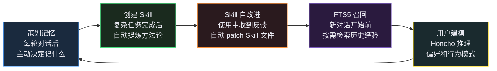
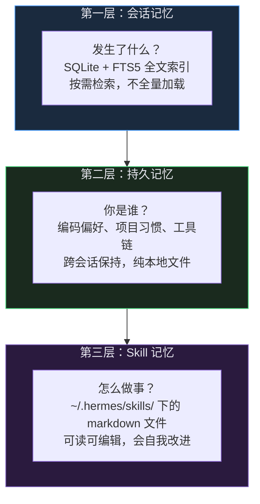

`tools/approval.py`

# Hermes Agent ☤ 完整指南

> Nous Research 出品 · MIT 开源 · 2026
> 整合技术分享 + 橙皮书精华，面向技术团队内部

---

## 目录

1. [认识 Hermes Agent](#1-认识-hermes-agent)
2. [整体架构](#2-整体架构)
3. [核心亮点深入](#3-核心亮点深入)
4. [快速上手](#4-快速上手)

---

## 1. 认识 Hermes Agent

### 1.1 它是什么

**Hermes Agent 是一个完整的、可自托管的 AI Agent 运行时，是 Harness Engineering 概念的第一次产品化。**

用一句话说：它是一个你可以部署在自己服务器上、接入任意 LLM、通过 Telegram/微信/命令行等任意渠道使用的 AI 助手框架——而且它会随着使用不断变得更聪明。

它不是：

- ❌ 一个 SDK 或库（不是 LangChain 那种"你来搭积木"的框架）
- ❌ 一个绑定特定模型的产品（不是只能用 Claude 或 GPT）
- ❌ 一个只能在本地跑的工具

它是：

- ✅ 一个**开箱即用的 Agent 运行时**，安装后直接可用
- ✅ **模型无关**：接入 200+ 模型，一行命令切换，零代码改动
- ✅ **平台无关**：同一个 Agent 同时服务 CLI、Telegram、飞书、Discord……
- ✅ **会自我进化**：从每次对话中提炼经验，写成技能，下次直接复用

```
你在 Telegram 发消息 → Hermes 在云服务器上执行任务
                     → 任务完成后把结果发回给你
                     → 顺便把这次学到的东西写成技能存起来
```

### 1.2 为什么会有它

**痛点一：每次对话都是白板**
今天教会它你的代码风格偏好，明天开新对话又得重新教一遍。大多数 Agent 框架没有跨会话的记忆，没有从经验中学习的能力。

**痛点二：绑定特定模型/平台**
很多工具深度绑定 OpenAI 或 Anthropic，换个模型要改大量代码。或者只能在命令行用，不能在手机上通过 Telegram 控制。

**痛点三：只能在本地跑**
大多数 Agent 工具假设你就坐在电脑前。但如果你想让 Agent 在服务器上跑一个耗时几小时的任务，同时你在外面用手机查看进度呢？

| 痛点          | Hermes 的解法                            |
| ------------- | ---------------------------------------- |
| 每次都是白板  | 闭环学习系统：技能自动创建 + 跨会话记忆  |
| 模型/平台绑定 | 插件化模型提供商 + 15+ 消息平台网关      |
| 只能本地跑    | 6 种终端后端（本地/Docker/SSH/云服务器） |

Hermes 的前身是 **OpenClaw**，一个简单的 CLI Agent 包装器。现在由 [Nous Research](https://nousresearch.com) 维护，MIT 开源，约 17,000 个测试用例。

### 1.3 它能做什么

**基础能力**：搜索、抓取网页、浏览器自动化、执行命令、操作文件、分析图片、执行 Python 脚本……

**多平台接入**：一个 `hermes gateway start` 命令，Agent 同时在线于：

```
Telegram · Discord · Slack · WhatsApp · Signal
飞书 · 钉钉 · 企业微信 · 微信 · QQ Bot · Email · SMS
```

**定时自动化**：

```bash
hermes cron add "每天早上 9 点总结昨天的 GitHub PR 动态，发到 Telegram"
hermes cron add "每周一生成上周工作报告"
```

**多 Agent 并行**：

```
"帮我同时测试这三个模块的性能"
→ Agent 自动拆分成 3 个子 Agent 并行执行 → 汇总结果
```

### 1.4 一个简单的闭环系统

Hermes 的架构可以用一条线串起来：

```
学习循环 → 三层记忆 → Skill 系统 → 40+ 工具 → 多平台 Gateway
```

其中最核心的是**学习循环**，五个环节形成一个持续改进的飞轮：



记忆提供了 Skill 创建的素材，Skill 在使用中积累反馈触发自改进，FTS5 让历史经验被精准召回，用户建模把这些碎片拼成一幅完整的画。**用得越多，每个环节都在变强，而且是同时变强。**

---

## 2. 整体架构

### 2.1 五层模型

```
┌──────────────────────────────────────────────────────────────┐
│  入口层                                                       │
│  hermes CLI/TUI · gateway（消息平台）· api_server · cron     │
├──────────────────────────────────────────────────────────────┤
│  会话管理层                                                   │
│  AIAgent · 预算控制 · 上下文压缩 · 记忆注入 · 提示构建       │
│  三层记忆（会话/持久/Skill）· Honcho 用户建模（可选外挂）    │
├──────────────────────────────────────────────────────────────┤
│  工具编排层                                                   │
│  工具分发 · 并行执行 · 危险命令守卫 · 插件钩子               │
├──────────────────────────────────────────────────────────────┤
│  工具注册层                                                   │
│  tools/registry.py（零依赖）· tools/*.py（自动发现）         │
├──────────────────────────────────────────────────────────────┤
│  模型提供商层                                                 │
│  plugins/model-providers/（28+ 提供商，插件化）              │
└──────────────────────────────────────────────────────────────┘
```


### 2.2 依赖链单向流动

```
tools/registry.py（零依赖）
      ↑ 被导入
tools/*.py（各自注册）
      ↑ 触发发现
model_tools.py（编排层）
      ↑ 被使用
run_agent.py / cli.py（入口）
```

添加一个新工具只需创建一个文件，`run_agent.py` 不需要改动任何一行。这是教科书级的开闭原则实践。

### 2.3 工具自动发现机制

```python
# tools/my_tool.py — 只需创建这一个文件
from tools.registry import registry

registry.register(
    name="my_tool",
    schema={...},
    handler=lambda args, **kw: my_tool(args),
)
# model_tools.py 在启动时自动扫描 tools/ 目录，import 每个文件，触发 register()
```

### 2.4 一个请求的完整生命周期

```
1. 用户发消息（Discord/Telegram/CLI）
        ↓
2. Gateway 接收 → 鉴权 → 加载会话历史
        ↓
3. AIAgent.run_conversation() 开始
   → 构建系统提示（注入技能列表、记忆、环境信息）
   → 调用 LLM API
        ↓
4. LLM 返回工具调用
        ↓
5. handle_function_call() 执行工具
   → 检查危险命令（47 个危险模式 + 12 个硬封锁）
   → 调用具体工具，返回结果
        ↓
6. LLM 收到结果，生成最终回答
        ↓
7. Gateway 把回答发回平台
        ↓
8. [后台，用户不感知，零延迟]
   Background Review Fork 启动（daemon 线程）
   → 分析对话有没有值得保存的技能或记忆
   → 写入 ~/.hermes/skills/ 或 MEMORY.md
```

### 2.5 三层插件系统

```
通用插件（~/.hermes/plugins/）
  → register(ctx) 注册工具、CLI 子命令、生命周期钩子
  → 插件 MUST NOT 修改核心文件（run_agent.py / gateway/run.py 等）

记忆提供商插件（plugins/memory/）
  → 实现 MemoryProvider ABC
  → 内置：honcho、mem0、supermemory、byterover 等 8 种

模型提供商插件（plugins/model-providers/）
  → 每个推理后端是一个插件，28+ 提供商
  → 用户插件覆盖内置插件（last-writer-wins）
```

---

## 3. 核心亮点深入

### 3.1 闭环学习系统：Agent 如何自己写"外挂"

#### 问题：为什么大多数 Agent 不会进化？

传统 Agent 的工作方式：

```
对话 1：用户教 Agent 如何处理 Python 依赖冲突
对话 2：用户又得重新教一遍
对话 3：还是得重新教
```

每次对话都是白板，经验无法积累。

#### Hermes 的解法：Background Review Fork

每次对话结束后，Hermes 会在后台悄悄做一件事：

```
主对话结束（用户立即收到回复，零延迟）
        ↓
[后台 daemon 线程启动，用户不感知]
        ↓
fork 一个新的 Agent 实例
→ 给它看刚才的完整对话记录
→ 问它："这次对话有没有值得保存的技能？"
        ↓
Review Agent 分析对话
→ 发现了一个处理 Python 依赖冲突的好方法
→ 调用 skill_manage(action="create") 写入技能文件
        ↓
~/.hermes/skills/python-deps/SKILL.md 创建完成
```

下次遇到类似问题，这个技能会被自动加载，Agent 直接复用经验。

#### 技能的"达尔文演化"

技能不是一次性写入的，它会随使用不断进化：

```
第 1 次：创建技能 "Python 依赖冲突处理"
第 3 次：用户说"你漏了检查虚拟环境这一步"
         → Review Fork 自动 patch 技能，补上这一步
第 10 次：技能已经包含了 10 次对话积累的经验
```

Review Agent 的 Prompt 明确要求优先 **patch 已有技能**，而不是无限新建：

```
优先级顺序：
1. 更新当前对话中已加载的技能（最优先）
2. 找到已有的同类技能并扩展它
3. 在已有技能下添加支持文件
4. 新建技能（最后手段）
```

#### Curator：技能的"自动清洁工"

**为什么需要 Curator？**

学习循环会持续创建和更新技能，但没有清理机制的话，技能库会越来越臃肿：

- 三个月前解决某个一次性问题的技能，现在已经没用了
- 同一类任务被创建了多个高度重叠的技能
- 某个技能的内容随着工具版本升级已经过时

技能库越大，每次对话注入的技能列表越长，LLM 的注意力越分散，反而降低质量。Curator 就是为了解决这个问题——**让技能库保持精简和准确**。

Curator 是一个定期运行的独立 Agent（默认每 7 天，Agent 空闲 2 小时后启动）：

```
扫描所有 Agent 创建的技能
        ↓
30 天未使用 → 标记为 stale（过时）
90 天未使用 → 自动归档到 .archive/（永不删除，可恢复）
发现重复技能 → 合并
发现错误内容 → 修复
```

**关键设计**：Curator **永远不删除**，只归档。用户随时可以 `hermes curator restore` 恢复任何归档的技能。这保证了"清洁"操作是可逆的，不会因为误判而丢失有价值的经验。

---

### 3.2 记忆设计：三层架构 + FTS5 全文搜索

#### 三层架构



三层各司其职，按需检索而不是全量加载。新对话开始时，Hermes 不会把过去所有对话历史都塞进来，而是根据当前话题用 FTS5 搜索相关的历史片段，只加载需要的部分。

#### FTS5 技术实现

```sql
-- 两张虚拟表，解决不同语言的搜索问题
CREATE VIRTUAL TABLE messages_fts USING fts5(
    session_id UNINDEXED,
    content
    -- unicode61 分词器，适合英文
);

CREATE VIRTUAL TABLE messages_fts_trigram USING fts5(
    session_id UNINDEXED,
    content,
    tokenize='trigram'  -- 3字节滑动窗口，解决中文无空格分词问题
    -- "你好世界" → ["你好世", "好世界"]，支持任意子串搜索
);
```

触发器自动同步：每次 INSERT/UPDATE/DELETE messages 表，触发器同步更新两张 FTS 表。索引内容 = `content || tool_name || tool_calls`，工具调用结果也可被搜索。

**Bookend 机制**：FTS5 命中的消息可能在一个很长的会话中间，`session_search` 工具会同时返回：

- 命中消息的上下文窗口（前后 N 条）
- 会话开头几条（了解背景）
- 会话结尾几条（了解结论）

一次搜索获得完整上下文，而不需要加载整个会话。

---

### 3.3 多 Agent 协作：4 种模式

| 模式              | 类比                           | 适用场景                 |
| ----------------- | ------------------------------ | ------------------------ |
| `delegate_task`   | 临时雇一个助手，等他完成再继续 | 需要隔离上下文的子任务   |
| Kanban 看板       | 公司的项目管理系统             | 跨进程/长期/多人协作任务 |
| MoA 多模型投票    | 开会让多个专家各自发表意见     | 极难的推理/分析问题      |
| Background Review | 下班后自己复盘写总结           | 技能/记忆的自动沉淀      |

**delegate_task vs Kanban 的核心区别**：

```
delegate_task：进程崩溃 → 任务丢失
Kanban：进程崩溃 → 重启后任务自动恢复（SQLite 持久化）
```

Kanban Dispatcher 的工业级机制：每 60 秒扫描，Worker 定期心跳，超时未心跳 → 任务被重新认领，连续失败 2 次 → 自动 Block 防止无限重试。对标 Celery/RabbitMQ 的去中心化翻版。

---

### 3.4 "有缰绳"：7 道控制机制

AI Agent 落地企业最大的障碍是**不可控**：无限循环、乱删数据、绕过安全检查……

| #    | 缰绳              | 代码位置                    | 作用                                          |
| ---- | ----------------- | --------------------------- | --------------------------------------------- |
| 1    | 预算上限          | `agent/iteration_budget.py` | 默认 90 次工具调用，防止无限循环              |
| 2    | Grace Call        | `conversation_loop.py L782` | 预算耗尽后优雅收尾，不粗暴截断                |
| 3    | 随时可中断        | `tools/interrupt.py`        | 父中断子也中断，不留孤儿进程                  |
| 4    | 危险命令审批      | `tools/approval.py`         | 12 个硬封锁 + 47 个危险模式                   |
| 5    | 工具循环守卫      | `agent/tool_guardrails.py`  | 检测重复失败/无进展的工具调用循环             |
| 6    | Cron 3 分钟硬中断 | `cron/scheduler.py`         | 防止定时任务失控占用调度器                    |
| 7    | YOLO 模式冻结     | `tools/approval.py`         | 模块 import 时冻结，防止 skill 运行时绕过审批 |

**YOLO 模式冻结的精妙之处**：

```python
# 在模块 import 时冻结，而不是每次调用时读取
_YOLO_MODE_FROZEN = is_truthy_value(os.getenv("HERMES_YOLO_MODE", ""))
```

如果每次调用都读取环境变量，一个恶意 skill 可以在运行时 `os.environ["HERMES_YOLO_MODE"] = "1"` 来绕过所有审批。冻结后，这个攻击路径被彻底关闭。

---

## 4. 快速上手

### 安装

```bash
# Linux / macOS / WSL2
curl -fsSL https://raw.githubusercontent.com/NousResearch/hermes-agent/main/scripts/install.sh | bash
source ~/.zshrc
hermes
```

### 接入阿里百炼（Qwen 系列）

```bash
# ~/.hermes/.env
DASHSCOPE_API_KEY=sk-xxxx
DASHSCOPE_BASE_URL=https://dashscope.aliyuncs.com/compatible-mode/v1

# 启动后选择模型
hermes model   # 选择 qwen 提供商 → qwen3.7-max
```

### 常用命令

```bash
hermes                    # 交互式 CLI
hermes --tui              # 现代 TUI 界面
hermes model              # 切换模型
hermes tools              # 配置工具集
hermes gateway start      # 启动消息网关（Telegram/Discord 等）

# 会话内命令
/skills                   # 查看已安装技能
/memory                   # 查看记忆内容
/session_search "关键词"  # 搜索历史会话
/new                      # 开始新会话
/compress                 # 手动压缩上下文
```

### Demo：看 Agent 自己创建技能

```bash
hermes
> 帮我分析一下这个目录下的 Python 项目结构，给出改进建议

# 对话结束后等几秒，会看到：
# 💾 Self-improvement review: Created skill 'python-project-analysis'

cat ~/.hermes/skills/python-project-analysis/SKILL.md
```

---

## 附录：核心文件速查

| 文件                         | 一句话说明                           |
| ---------------------------- | ------------------------------------ |
| `run_agent.py`               | AIAgent 类，核心对话循环（~12k LOC） |
| `agent/conversation_loop.py` | 主循环实现，所有核心逻辑             |
| `model_tools.py`             | 工具编排，连接 Agent 和工具          |
| `toolsets.py`                | 定义哪些工具组合在一起               |
| `hermes_state.py`            | 会话历史存储（SQLite + FTS5）        |
| `agent/background_review.py` | 后台技能/记忆回顾（daemon 线程）     |
| `agent/curator.py`           | 技能生命周期管理                     |
| `tools/approval.py`          | 危险命令审批系统                     |
| `tools/delegate_tool.py`     | 子 Agent 委派                        |
| `tools/kanban_tools.py`      | Kanban 多 Agent 协作                 |
| `gateway/run.py`             | 消息网关（15+ 平台，~17k LOC）       |
| `tools/registry.py`          | 工具注册表（零依赖）                 |

---

*基于 hermes-agent main 分支（2026-05）· MIT License · [GitHub](https://github.com/NousResearch/hermes-agent)*
