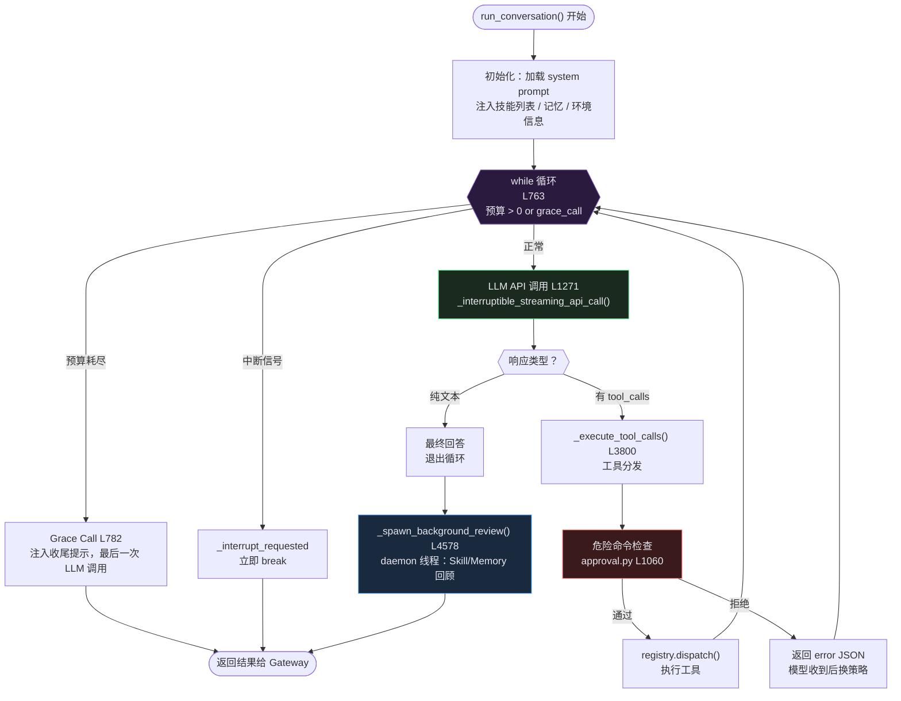
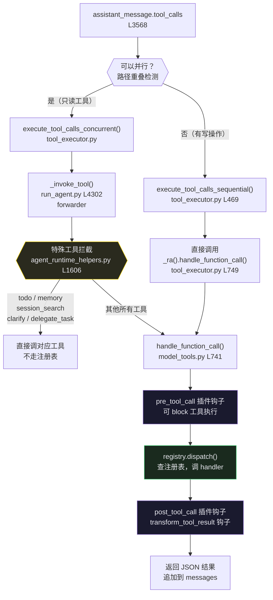
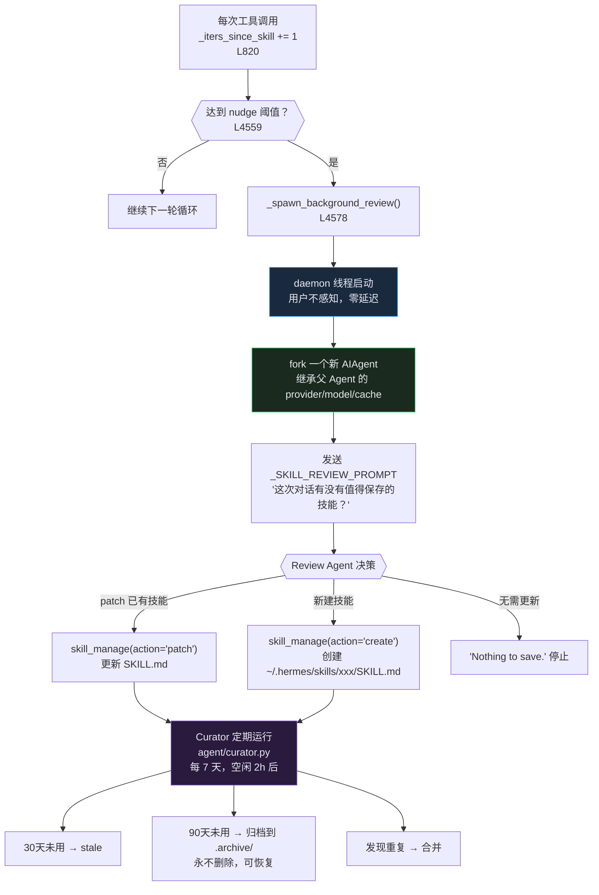

# Hermes Agent — 架构流转与 Debug 指南

> 面向想深入理解代码结构、或需要在 PyCharm 中 Debug 的工程师。
> 基于 hermes-agent main 分支（2026-05）。

---

## 1. 整体架构流转

### 1.1 主循环内部流转



### 1.2 工具分发详细路径

内置工具+通用工具：



### 1.3 Skill 闭环学习流程



---

## 2. 详细调用链路（带行号）

```
STEP 1  消息到达
━━━━━━━━━━━━━━━━━━━━━━━━━━━━━━━━━━━━━━━━━━━━━━━━━━━━━━━━━━━━━
plugins/platforms/discord/adapter.py
  L754   async def on_message(message)
  L848       await self._handle_message(message)

STEP 2  构建 MessageEvent
━━━━━━━━━━━━━━━━━━━━━━━━━━━━━━━━━━━━━━━━━━━━━━━━━━━━━━━━━━━━━
plugins/platforms/discord/adapter.py
  L4487  async def _handle_message(message)
  L4853      event = MessageEvent(...)
  L4882      await self.handle_message(event)

STEP 3  Base Adapter 转发
━━━━━━━━━━━━━━━━━━━━━━━━━━━━━━━━━━━━━━━━━━━━━━━━━━━━━━━━━━━━━
gateway/platforms/base.py
  L3391  async def handle_message(event)
  L3463      response = await self._message_handler(event)
             ↑ 启动时注册：gateway/run.py L4184
               adapter.set_message_handler(self._handle_message)

STEP 4  Gateway 路由（鉴权 / 命令拦截 / 会话管理）
━━━━━━━━━━━━━━━━━━━━━━━━━━━━━━━━━━━━━━━━━━━━━━━━━━━━━━━━━━━━━
gateway/run.py
  L6835  async def _handle_message(event)
  L7944      await self._handle_message_with_agent(...)

STEP 5  Agent 调度（约 636 行准备工作）
━━━━━━━━━━━━━━━━━━━━━━━━━━━━━━━━━━━━━━━━━━━━━━━━━━━━━━━━━━━━━
gateway/run.py
  L8267  async def _handle_message_with_agent(...)
  L8396      build_session_context_prompt()   ← 构建 context_prompt
  L8499      load_transcript()                ← 加载会话历史
  L8578      _resolve_session_agent_runtime() ← 决定模型/provider
  L8904      agent_result = await self._run_agent(...)

STEP 6  _run_agent（约 690 行准备工作）
━━━━━━━━━━━━━━━━━━━━━━━━━━━━━━━━━━━━━━━━━━━━━━━━━━━━━━━━━━━━━
gateway/run.py
  L16014 async def _run_agent(...)
  L16705     def run_sync():              ← 同步函数，丢入线程池
  L16902         agent = AIAgent(...)     ← 真正创建 Agent
  L17343         result = agent.run_conversation(...)
  L17xxx     await loop.run_in_executor(None, run_sync)

STEP 7  run_conversation（forwarder）
━━━━━━━━━━━━━━━━━━━━━━━━━━━━━━━━━━━━━━━━━━━━━━━━━━━━━━━━━━━━━
run_agent.py
  L4344  def run_conversation(self, ...)
  L4355      return run_conversation(self, ...)  ← 透传

STEP 8  主循环
━━━━━━━━━━━━━━━━━━━━━━━━━━━━━━━━━━━━━━━━━━━━━━━━━━━━━━━━━━━━━
agent/conversation_loop.py
  L353   def run_conversation(agent, ...)
  L763   while (...iteration_budget...) or agent._budget_grace_call:
  L782       if agent._budget_grace_call:        ← Grace Call
  L820       agent._iters_since_skill += 1
  L1271      response = agent._interruptible_streaming_api_call(api_kwargs)
  L3800      agent._execute_tool_calls(...)
  L4559      if agent._iters_since_skill >= agent._skill_nudge_interval:
  L4578          agent._spawn_background_review(...)

STEP 9  LLM 调用（子线程）
━━━━━━━━━━━━━━━━━━━━━━━━━━━━━━━━━━━━━━━━━━━━━━━━━━━━━━━━━━━━━
run_agent.py
  L3432  def _interruptible_streaming_api_call(self, ...)  ← forwarder

agent/chat_completion_helpers.py
  L1515  def interruptible_streaming_api_call(agent, ...)
  L2038      def _call():                    ← 子线程执行
  L2058          result["response"] = _call_chat_completions()
  L2311      t = threading.Thread(target=_call); t.start()
  L2314      while t.is_alive(): t.join(0.3)  ← 主线程轮询中断

  L1669  def _call_chat_completions():
             client.chat.completions.create(...)  ← HTTP 请求

STEP 10  工具分发
━━━━━━━━━━━━━━━━━━━━━━━━━━━━━━━━━━━━━━━━━━━━━━━━━━━━━━━━━━━━━
run_agent.py
  L4255  def _execute_tool_calls(self, ...)
    ├── 并行 → L4329 _execute_tool_calls_concurrent()
    └── 串行 → L4334 _execute_tool_calls_sequential()

agent/agent_runtime_helpers.py
  L1606  def invoke_tool(agent, function_name, ...)
    ├── todo / memory / session_search / clarify / delegate_task → 直接调
    └── 其他 → L1689 _ra().handle_function_call(...)

model_tools.py
  L741   def handle_function_call(...)
             registry.dispatch(function_name, function_args)

STEP 11  危险命令审批（terminal 工具内部）
━━━━━━━━━━━━━━━━━━━━━━━━━━━━━━━━━━━━━━━━━━━━━━━━━━━━━━━━━━━━━
tools/approval.py
  L1060  check_all_command_guards()   ← 综合入口
  L274   detect_hardline_command()    ← 12 个硬封锁
  L482   detect_dangerous_command()   ← 47 个危险模式
  L710   prompt_dangerous_approval()  ← 弹出审批

STEP 12  Skill 回顾（daemon 线程）
━━━━━━━━━━━━━━━━━━━━━━━━━━━━━━━━━━━━━━━━━━━━━━━━━━━━━━━━━━━━━
run_agent.py
  L1336  def _spawn_background_review(self, ...)
  L1351      target, _prompt = spawn_background_review_thread(...)

agent/background_review.py
  L562   def spawn_background_review_thread(agent, ...)
             threading.Thread(target=_target, daemon=True)
             → review_agent.run_conversation(_SKILL_REVIEW_PROMPT)
             → skill_manage(action="create/patch")
```

---

## 3. 推荐断点顺序

| # | 文件 | 行号 | 说明 |
|---|------|------|------|
| 1 | `discord/adapter.py` | L754 | 消息到达 |
| 2 | `discord/adapter.py` | L4487 | 构建 MessageEvent |
| 3 | `gateway/run.py` | L6835 | Gateway 鉴权路由 |
| 4 | `gateway/run.py` | L8267 | 进入 Agent 调度 |
| 5 | `gateway/run.py` | L8904 | 调用 `_run_agent()` |
| 6 | `gateway/run.py` | L16705 | `run_sync()` 线程池入口 |
| 7 | `gateway/run.py` | L16902 | `AIAgent(...)` 创建 |
| 8 | `gateway/run.py` | L17343 | `agent.run_conversation()` |
| 9 | `conversation_loop.py` | L763 | 主循环 while |
| 10 | `conversation_loop.py` | L3800 | 工具调用分支 |
| 11 | `agent_runtime_helpers.py` | L1606 | `invoke_tool()` 入口 |
| 12 | `model_tools.py` | L741 | 注册表工具分发 ⚠️ 需 Suspend All |
| 13 | `approval.py` | L1060 | 危险命令检查 |
| 14 | `chat_completion_helpers.py` | L2311 | LLM 子线程启动 |
| 15 | `chat_completion_helpers.py` | L1669 | 真正的 HTTP 请求 ⚠️ 需 Suspend All |
| 16 | `conversation_loop.py` | L4559 | Skill 触发判断 |
| 17 | `background_review.py` | L562 | 后台 fork 线程 |

---

## 4. Debug 注意事项

### 子线程断点

以下代码在**子线程**里执行，PyCharm 默认只暂停当前线程，断点不触发：

- `chat_completion_helpers.py` 的 `_call()` — LLM HTTP 请求
- `model_tools.py` 的 `handle_function_call()` — 工具分发（ThreadPoolExecutor）
- `background_review.py` — Skill 回顾

**解决方法**：右键断点 → Edit Breakpoint → Suspend 改为 **All**

### 线程切换

断点触发后，在 **Threads** 面板切换：

| 线程名 | 内容 |
|--------|------|
| 主线程 | `gateway/run.py` async 事件循环 |
| `ThreadPoolExecutor-0_x` | `run_sync()`，Agent 主循环在这里 |
| `Thread-x` | `_call()`，LLM HTTP 请求 |
| `Thread-x (daemon)` | Background Review，Skill 回顾 |

### skill_view 是什么时候触发的

不是检索命中，是 system prompt 里注入了技能列表，LLM **主动决策**调用 `skill_view`。

触发路径：
```
agent/prompt_builder.py
  build_skills_system_prompt()
    → 扫描 ~/.hermes/skills/
    → 生成 <available_skills> 列表注入 system prompt

LLM 看到用户消息 → 匹配技能名 → 第一个工具调用就是 skill_view("xxx")
```

断点打在 `agent/prompt_builder.py` 的 `build_skills_system_prompt()` 可以看到完整注入内容。

### session_search 的 FTS5 实现

```
tools/session_search_tool.py
  → hermes_state.py SessionDB.search_messages()
    → SELECT ... FROM messages_fts WHERE messages_fts MATCH ?
       (英文：unicode61 分词)
    → SELECT ... FROM messages_fts_trigram WHERE messages_fts_trigram MATCH ?
       (中文：trigram 3字节滑动窗口)
```

搜索结果带 Bookend：命中消息 + 会话开头几条 + 会话结尾几条，一次调用获得完整上下文。
